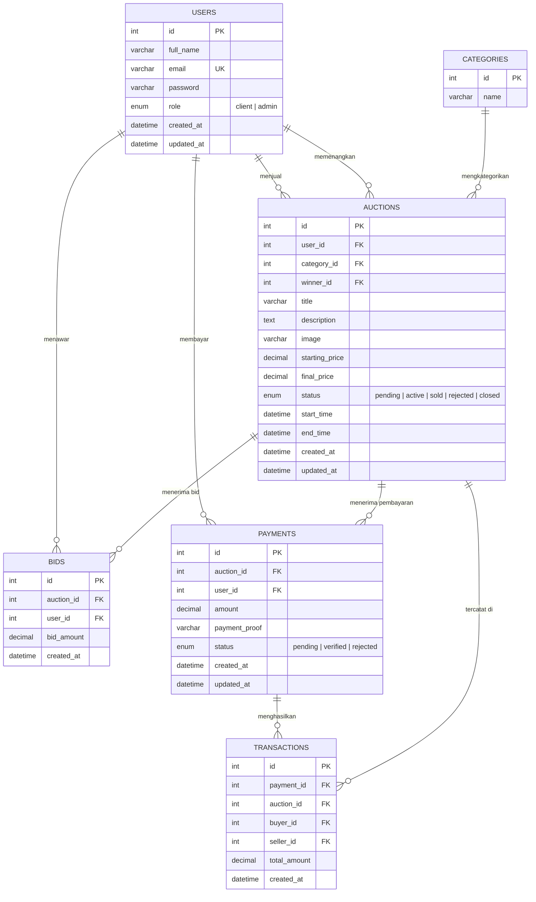

<p align="center">
  
  
  
  
</p>

<h1 align="center">🔨 Mieso Auction</h1>

<p align="center">
  <i>Platform lelang online berbasis web dengan validasi multi-tahap oleh admin untuk memastikan setiap transaksi berjalan aman, transparan, dan terpercaya.</i>
</p>

---

## Built With

**Backend**

[](https://www.php.net/)
[](https://www.php.net/manual/en/book.pdo.php)
[](https://httpd.apache.org/)

**Frontend**

[](https://developer.mozilla.org/en-US/docs/Web/HTML)
[](https://developer.mozilla.org/en-US/docs/Web/CSS)
[](https://developer.mozilla.org/en-US/docs/Web/JavaScript)

**Database**

[](https://www.mysql.com/)

**Development Environment**

[](https://laragon.org/)

---

## 📋 Deskripsi

**Mieso Auction** adalah platform lelang online yang dibangun menggunakan **PHP Native** dengan arsitektur **Custom MVC (Model-View-Controller)** tanpa framework eksternal. Sistem ini dirancang untuk menciptakan ekosistem lelang yang **aman** dan **terorganisir** melalui mekanisme **validasi multi-tahap oleh admin** di setiap proses kritis.

- **Aplikasi**: Platform lelang online berbasis web untuk penawaran barang secara real-time
- **Target Pengguna**: Penjual yang ingin melelang barang, pembeli yang ingin menawar, dan admin yang mengawasi seluruh proses
- **Masalah yang Diselesaikan**: Mengurangi risiko penipuan dan ketidakakuratan transaksi pada proses lelang konvensional yang tidak memiliki mekanisme verifikasi
- **Tujuan Sistem**: Menyediakan alur kerja lelang yang terkontrol, transparan, dan aman bagi semua pihak melalui validasi admin pada setiap tahap penting — mulai dari pengajuan barang hingga konfirmasi pembayaran

---

## ⚙️ Bagaimana Sistem Bekerja?

| Bagian | Penjelasan |
|---|---|
| **Pengajuan Lelang** | Penjual (client) mengajukan barang untuk dilelang dengan mengisi data lengkap (judul, deskripsi, foto, harga awal, estimasi nilai, waktu mulai & berakhir). Barang yang diajukan masuk dengan status `pending` dan harus menunggu persetujuan admin sebelum tampil di halaman publik. |
| **Verifikasi Admin** | Admin mereview setiap pengajuan lelang. Admin dapat **menyetujui** (`active`) agar barang tampil dan terbuka untuk penawaran, atau **menolak** (`rejected`) jika barang tidak memenuhi syarat. |
| **Proses Bidding** | Setelah lelang aktif, pembeli yang sudah login dapat memasukkan penawaran (bid). Sistem memvalidasi bahwa setiap bid **harus lebih tinggi** dari harga tertinggi saat ini. Harga `final_price` di-update otomatis setiap kali ada bid baru. |
| **Auto-Close Auction** | Ketika waktu lelang berakhir (`end_time` < sekarang), sistem secara **otomatis menutup** lelang, menentukan pemenang berdasarkan bid tertinggi, dan mengubah status menjadi `closed`. Pemenang otomatis ditandai di field `winner_id`. |
| **Koleksi Pemenang (My Bids)** | Barang yang dimenangkan muncul di halaman **"My Bids"** milik pemenang beserta statistik (total pengeluaran, jumlah item menang, status pembayaran). Dari sini, pemenang bisa melihat detail transaksi dan memulai proses pembayaran. |
| **Pembayaran & Upload Bukti** | Pemenang mengupload **bukti pembayaran** (gambar). Sistem mendukung format JPG, PNG, WebP, dan HEIC dengan batas ukuran 10MB. Jika pembayaran ditolak admin, pemenang dapat mengunggah ulang bukti baru. |
| **Verifikasi Pembayaran** | Admin memverifikasi bukti pembayaran. Jika disetujui (`verified`), status lelang otomatis berubah menjadi `sold` — menandai transaksi telah selesai. Jika ditolak (`rejected`), pembeli mendapat notifikasi untuk mengunggah ulang. |
| **Manajemen User** | Admin dapat melihat seluruh daftar pengguna, menghapus user, dan membuat akun admin baru langsung dari dashboard. |

> **💡 Contoh Simulasi:**
> 1. **Yohanes** mendaftar sebagai client dan mengajukan barang *"Classic Mustang 1967"* → Status: `pending`
> 2. **Admin Christian** mereview dan menyetujui barang tersebut → Status: `active`, lelang terbuka
> 3. **Daren** dan **Meivaldi** saling menawar. Meivaldi memasukkan bid tertinggi Rp 90.000
> 4. Waktu lelang habis → Sistem otomatis menutup lelang, **Meivaldi** ditetapkan sebagai pemenang
> 5. Meivaldi membuka halaman **"My Bids"**, melihat barang yang dimenangkan, dan mengupload bukti transfer
> 6. **Admin** memverifikasi pembayaran → Status berubah menjadi `sold`, transaksi selesai ✅

---

## ✨ Fitur

### 🌐 General (Tanpa Login)
- **Halaman Beranda** — Menampilkan daftar barang lelang yang sedang aktif sebagai landing page
- **Daftar Lelang (Auction Listing)** — Menelusuri semua barang aktif dengan filter berdasarkan kategori (Fine Art, Real Estate, Cars, Jewelry, dll.)
- **Detail Lelang** — Melihat informasi lengkap barang, harga saat ini, countdown timer, dan riwayat bid
- **Registrasi & Login** — Sistem autentikasi dengan hashing password menggunakan `bcrypt`

### 👤 Client (Pembeli / Penjual)
- **Submit Auction** — Mengajukan barang untuk dilelang dengan upload foto dan pengaturan waktu (status awal: `pending`)
- **My Auctions** — Melihat dan mengelola (edit/hapus) barang lelang milik sendiri selama masih berstatus `pending`
- **Place Bid** — Memasukkan penawaran harga pada lelang aktif dengan validasi harga minimum
- **My Bids (Koleksi Saya)** — Dashboard personal yang menampilkan semua barang yang dimenangkan, statistik penawaran, dan status pembayaran
- **Upload Bukti Pembayaran** — Mengunggah bukti transfer untuk barang yang dimenangkan (mendukung JPG/PNG/WebP/HEIC, maks. 10MB)
- **Re-upload Bukti** — Mengunggah ulang bukti pembayaran jika ditolak oleh admin
- **Profil & Ubah Password** — Melihat profil, statistik pengguna (jumlah partisipasi, kemenangan), dan mengubah password

### 🛡️ Admin
- **Dashboard Admin** — Ringkasan sistem (jumlah user, jumlah lelang pending, jumlah pembayaran menunggu, total transaksi)
- **Verifikasi Lelang** — Menyetujui (`approve`) atau menolak (`reject`) pengajuan lelang dari client
- **Verifikasi Pembayaran** — Memverifikasi (`verified`) atau menolak (`rejected`) bukti pembayaran, dengan filter berdasarkan status (Pending / Approved / Rejected / All)
- **Manajemen User** — Melihat daftar semua pengguna dan menghapus user
- **Buat Admin Baru** — Membuat akun administrator baru dengan validasi email unik

### 🔧 Sistem
- **Auto-Close Auction** — Otomatis menutup lelang yang sudah melewati `end_time`, menentukan pemenang, dan mengupdate `final_price`
- **Real-time Current Price** — API endpoint untuk mengambil harga terkini dari sebuah lelang (`api/current-price/{id}`)
- **File Upload System** — Helper terpisah untuk manajemen upload file dengan validasi ekstensi, ukuran, dan error handling
- **Session-based Auth** — Sistem autentikasi berbasis session dengan role-based access control (`client` / `admin`)
- **Route Guard** — Proteksi route berdasarkan role menggunakan `Auth::redirectAdmin()` dan `Auth::redirectClient()`

---

## 🗂️ Kategori Lelang

| Kategori | Contoh Barang |
|---|---|
| 🎨 Fine Art | Lukisan, seni abstrak |
| 🏠 Real Estate | Apartemen, rumah pantai, kabin |
| 🏺 Antique | Vas kuno, masker tribal |
| 🚗 Cars | Mobil klasik, sport car, luxury car |
| 🏍️ Motorcycle | Motor koleksi |
| 💎 Jewelry | Kalung berlian, cincin emas |
| 💻 Electronic | Perangkat elektronik |
| 📱 Gadget | iPhone, MacBook, iMac, Tablet |
| ⌚ Watch | Rolex, jam tangan mewah |
| ✈️ Aviation | Model pesawat koleksi |

---

## 🏗️ Arsitektur

Proyek ini menggunakan arsitektur **Custom MVC (Model-View-Controller)** yang dibangun dari nol tanpa framework PHP eksternal. Pendekatan ini memberikan kontrol penuh atas alur aplikasi dan meminimalkan overhead dari dependency yang tidak diperlukan.

### Pola Arsitektur

| Aspek | Implementasi |
|---|---|
| Pattern | Custom MVC |
| Routing | Array-based route mapping (`routes/web.php`) dengan regex parameter matching |
| Database | PDO Singleton Pattern (`DbConnection`) |
| Authentication | Session-based dengan Role Guard |
| File Upload | Helper class dengan validasi terintegrasi |
| Templating | PHP Native dengan layout system (Main / Auth) dan content buffering (`ob_start`) |

---

## Alur Layer

```text
┌─────────────────────────────────────────────────────┐
│                    PUBLIC / ENTRY                     │
│           public/index.php + .htaccess               │
│  Semua request masuk melalui single entry point.     │
│  URL di-parse dan dicocokkan dengan route map.       │
└──────────────────────┬──────────────────────────────┘
                       │
                       ▼
┌─────────────────────────────────────────────────────┐
│                      ROUTES                          │
│                 routes/web.php                        │
│  Array mapping URL → Controller@Method.              │
│  Mendukung parameter dinamis {id} via regex.         │
└──────────────────────┬──────────────────────────────┘
                       │
                       ▼
┌─────────────────────────────────────────────────────┐
│                   CONTROLLER                         │
│              app/controllers/*.php                   │
│  Menerima request, menjalankan logika bisnis,        │
│  memanggil model untuk akses data, dan               │
│  mengirim data ke view untuk di-render.              │
│                                                      │
│  ┌────────────────────────────────────────────┐      │
│  │             HELPERS / MIDDLEWARE            │      │
│  │  Auth.php → Role checking & route guard    │      │
│  │  Session.php → Session management          │      │
│  │  Upload.php → File upload & validation     │      │
│  └────────────────────────────────────────────┘      │
└──────────────────────┬──────────────────────────────┘
                       │
                       ▼
┌─────────────────────────────────────────────────────┐
│                     MODEL                            │
│               app/models/*.php                       │
│  Berinteraksi langsung dengan database via PDO.      │
│  Menyediakan method CRUD dan query kompleks          │
│  dengan JOIN untuk relasi antar tabel.               │
└──────────────────────┬──────────────────────────────┘
                       │
                       ▼
┌─────────────────────────────────────────────────────┐
│                    DATABASE                          │
│              MySQL / MariaDB                         │
│  5 tabel utama: users, auctions, bids,              │
│  payments, transactions + categories.                │
│  Relasi foreign key dengan CASCADE / SET NULL.       │
└─────────────────────────────────────────────────────┘
                       ▲
                       │ (data dikembalikan)
                       │
┌─────────────────────────────────────────────────────┐
│                      VIEW                            │
│               app/Views/**/*.php                     │
│  Menerima data dari controller via extract().        │
│  Menggunakan layout system (Main.php / Auth.php)     │
│  dengan output buffering untuk content injection.    │
│  Custom CSS & JS per halaman.                        │
└─────────────────────────────────────────────────────┘
```

---

## 📂 Struktur Proyek

```
MiesoAuction/
├── app/
│   ├── controllers/                # Controller layer
│   │   ├── AboutUsController.php       # Halaman About Us
│   │   ├── AdminController.php         # Dashboard, verifikasi lelang, manajemen user
│   │   ├── AdminPaymentController.php  # Verifikasi & reject pembayaran oleh admin
│   │   ├── AuctionController.php       # CRUD lelang, auto-close, listing
│   │   ├── AuthController.php          # Login, register, logout
│   │   ├── BidController.php           # Place bid, my bids, transaksi pemenang
│   │   ├── CategoryController.php      # CRUD kategori
│   │   ├── HomeController.php          # Halaman beranda
│   │   ├── PaymentController.php       # Upload bukti bayar, proses pembayaran
│   │   ├── ProfileController.php       # Profil user, ubah password, my auctions
│   │   └── TransactionController.php   # Riwayat transaksi
│   │
│   ├── core/                       # Core framework
│   │   ├── Controller.php              # Base controller (view rendering, model loading)
│   │   └── DbConnection.php           # PDO singleton database connection
│   │
│   ├── helpers/                    # Utility classes
│   │   ├── Upload.php                  # File upload handler dengan validasi
│   │   └── auth/
│   │       ├── Auth.php                # Authentication & authorization (role guard)
│   │       └── Session.php             # Session management wrapper
│   │
│   ├── models/                     # Model / Data Access layer
│   │   ├── Auction.php                 # Query lelang (CRUD, relasi, auto-close, filter)
│   │   ├── Bid.php                     # Query bid (place bid, highest bid, history)
│   │   ├── Category.php                # Query kategori (CRUD)
│   │   ├── Payment.php                 # Query pembayaran (CRUD, filter status, relasi)
│   │   ├── Transaction.php             # Query transaksi (CRUD, relasi buyer/seller)
│   │   └── User.php                    # Query user (CRUD, auth, password management)
│   │
│   └── Views/                      # View / Presentation layer
│       ├── layouts/
│       │   ├── Main.php                # Layout utama (navbar, footer, CSS/JS injection)
│       │   ├── Auth.php                # Layout halaman autentikasi
│       │   └── partials/               # Komponen reusable (navbar, footer)
│       ├── Admin/                      # Halaman admin (dashboard, verifikasi, manajemen)
│       ├── Auction/                    # Halaman lelang (listing, detail, create, edit)
│       ├── Auth/                       # Halaman login & register
│       ├── Home/                       # Halaman beranda / landing page
│       ├── Payment/                    # Halaman pembayaran
│       ├── bids/                       # Halaman my bids & transaksi pemenang
│       └── profile/                    # Halaman profil & my auctions
│
├── config/
│   └── config.php                  # Konfigurasi database & BASE_URL
│
├── public/                         # Document root (web-accessible)
│   ├── index.php                       # Single entry point & router
│   ├── .htaccess                       # URL rewriting (Apache mod_rewrite)
│   └── assets/
│       ├── style/                      # CSS per halaman (13 file)
│       ├── js/                         # JavaScript per halaman
│       ├── img/                        # Gambar statis
│       ├── uploads/                    # Upload user (auction images, payment proof)
│       └── Plus_Jakarta_Sans/          # Custom font
│
├── routes/
│   └── web.php                     # Definisi seluruh route aplikasi
│
└── db_auction.sql                  # Database schema & seed data
```

---

## 🗄️ Skema Database



---

## 🔄 Alur Status Lelang

```text
    ┌──────────┐       Admin Approve       ┌──────────┐
    │ PENDING  │ ─────────────────────────► │  ACTIVE  │
    └──────────┘                            └──────────┘
         │                                       │
         │ Admin Reject                          │ Waktu habis
         ▼                                       │ (auto-close)
    ┌──────────┐                                 ▼
    │ REJECTED │                            ┌──────────┐
    └──────────┘                            │  CLOSED  │
                                            └──────────┘
                                                 │
                                                 │ Pembayaran
                                                 │ terverifikasi
                                                 ▼
                                            ┌──────────┐
                                            │   SOLD   │
                                            └──────────┘
```

---

## 🔄 Alur Status Pembayaran

```text
    ┌──────────┐       Admin Verify        ┌──────────┐
    │ PENDING  │ ─────────────────────────► │ VERIFIED │
    └──────────┘                            └──────────┘
         │                                       │
         │ Admin Reject                          │ Otomatis
         ▼                                       │ set auction → SOLD
    ┌──────────┐                                 ▼
    │ REJECTED │                         Transaksi Selesai ✅
    └──────────┘
         │
         │ User upload ulang
         ▼
    ┌──────────┐
    │ PENDING  │ (kembali menunggu verifikasi)
    └──────────┘
```

---

## 🚀 Instalasi & Setup

### Prasyarat
- **PHP** >= 8.0
- **MySQL** / **MariaDB** >= 10.4
- **Apache** dengan `mod_rewrite` aktif
- **Laragon** (disarankan) atau **XAMPP** / **WAMP**

### Langkah Instalasi

1. **Clone repository**
   ```bash
   git clone https://github.com/username/MiesoAuction.git
   ```

2. **Tempatkan di document root**
   ```
   # Untuk Laragon:
   C:\laragon\www\MiesoAuction\
   
   # Untuk XAMPP:
   C:\xampp\htdocs\MiesoAuction\
   ```

3. **Buat database**
   ```sql
   CREATE DATABASE db_auction;
   ```

4. **Import schema & data**
   ```bash
   mysql -u root -p db_auction < db_auction.sql
   ```

5. **Konfigurasi koneksi database**
   
   Edit file `config/config.php`:
   ```php
   define("DB_HOST", "localhost");
   define("DB_NAME", "db_auction");
   define("DB_USER", "root");
   define("DB_PASS", "");
   
   define("BASE_URL", "http://miesoauction.test/");
   ```

6. **Setup virtual host** (Laragon otomatis, atau manual di Apache)
   ```apache
   <VirtualHost *:80>
       DocumentRoot "C:/laragon/www/MiesoAuction/public"
       ServerName miesoauction.test
   </VirtualHost>
   ```

7. **Akses aplikasi**
   ```
   http://miesoauction.test/
   ```

### 👤 Akun Default

| Role | Email | Password |
|---|---|---|
| Admin | christianpiterwiyoso@gmail.com | *(sesuai hash di database)* |
| Client | yohanes@gmail.com | *(sesuai hash di database)* |

---

## 🛡️ Keamanan

| Aspek | Implementasi |
|---|---|
| **Password Hashing** | `password_hash()` dengan algoritma `bcrypt` (`PASSWORD_DEFAULT` / `PASSWORD_BCRYPT`) |
| **SQL Injection Prevention** | Prepared Statements (PDO) dengan parameter binding di seluruh query |
| **Role-based Access Control** | Route guard otomatis menggunakan `Auth::redirectAdmin()` dan `Auth::redirectClient()` |
| **Session Security** | Session regeneration saat logout, cookie cleanup, session hijacking prevention |
| **File Upload Validation** | Validasi ekstensi (JPG/PNG/WebP/HEIC), batas ukuran (10MB), dan unique filename dengan `uniqid()` |
| **Input Validation** | Validasi field wajib, pengecekan email duplikat, konfirmasi password match |

---

## 👥 Tim Pengembang

Dibangun oleh **Tim Mieso** sebagai proyek platform lelang yang mengutamakan keamanan dan transparansi transaksi.

---

<p align="center">
  <sub>Made with ❤️ using Pure PHP · No Framework · Full Control</sub>
</p>
